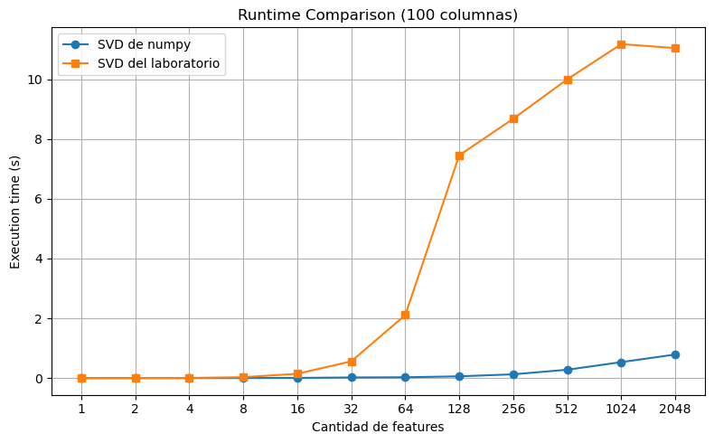
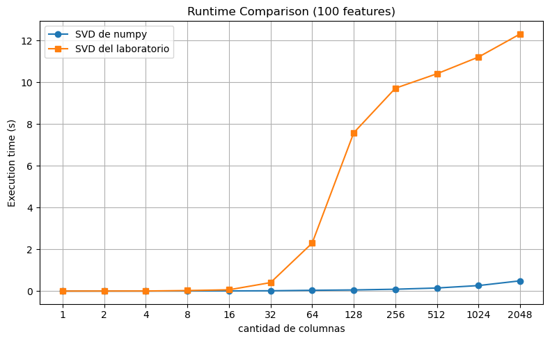

# Informe

## Elección de algoritmo para la última capa
El objetivo de nuestro informe es encontrar la mejor manera de estimar $W$ la matriz de parámetros de la última capa en la red de clasificación, entre todas las alternativas vistas en la materia Álgebra Lineal Computacional.

Para ello, vamos a comparar el calculo de $W$ en función de su precisión y tiempo. 

> Donde:
> - $\text{Precision} = \frac{\text{TP}}{\text{TP + TF}}$
> - Y el tiempo lo calculamos entre la ejecución de cada función que computa $W$.

Además, agregamos una matríz $W_r$ inicializada con valores random para tener una medida de control.

**Los resultados de nuestros experimentos fueron los siguientes:**

| Algoritmo| Precision | Tiempo (s) |
|----------|-----------|------------|
| *SVD ($*^1$)*      | $68,4 \%$ | $101.4$  | 
| *Cholesky* | $68,4 \%$ | $106.7$  | 
| *QR HH* | $68,4 \%$ | $183.1$  | 
| *Random* | $50,2 \%$ | $\sim 0$ | 
| *QR GS* | $68,4 \%$ | $44$| 

> <u>Observación ($*^1$)</u>:
> Estamos utilizando la función `np.linalg.svd(..)` en reemplazo de la implementada en el laboratorio porque la nuestra tiene un rápido crecimiento exponencial en su tiempo de cómputo para matrices de la dimensión del trabajo.

### Calidad de resultados
Notamos que las cuatro estrategias presentadas obtienen una performance igual en cuanto a precisión, por lo que no se puede definir a un algoritmo como mejor que otro (en términos de precisión). Cholesky y SVD tienden a una performance similar en cuanto a tiempo, mientras que QR y HH difieren mucho entre sí.

La complejidad de las dos QR difiere tanto debido al costo computacional de cada uno de los algoritmos. En el caso de GS es de $O(n^3)$, mientras que en el caso de HH es de $O(n^4)$ ya que estamos formando las matrices $H$ completas y aplicándolas a todo $R$ y todo $Q$ en cada paso.

Además, el hecho de que en el algoritmo de SVD no se utilice de forma directa $X^TX$ como paso intermedio nos libra del problema de mal condicionamiento que afecta a QR y Cholesky, y lo vuelve la mejor opción para calcular la matriz de parámetros $W$.

### Performance temporal
Respecto a tiempo, particularmente notamos la diferencia en cuanto a complejidad y rapidez de calculo entre nuestras implementaciones y las de `numpy` en los siguientes casos:

|Casos | Numpy | Laboratorios | Observacion |
|-------|--------|----------|-------------|
| SVD | `np.linalg.svd(X, full_matrices=False)`| `alc.svd_reducida(X)` | Observación $*^1 *^2$.| 
| traspuesta | `X.T` | `alc.traspuesta(X)` | Optimizamos el doble forloop gracias al operador `:` de python|

> <u>Observación ($*^2$):</u>
> Observamos que la implementacion de SVD con el algoritmo del laboratorio tiene un rendimiento mucho mas lento que el de numpy tanto en funcion de cantidad de imagenes clasificadas como la cantidad de features por imagen.
  

La experimentacion esta disponible en el [Notebook](Experiments.ipynb).
